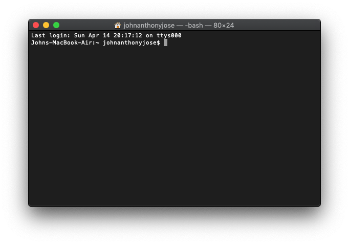

# deeplearning-crash-course

# Opening your terminal

#### For MacOS and Ubuntu, 

1. Open your search bar, and type terminal. Afterwards, you should see something like this


2. Type the ff:
```bash
$cd ~/Desktop
$pwd
/Users/your-unix-name/Desktop
```

### For Windows Subsystem for Linux

1. Click windows button, type and open Your Command prompt. You should something like this
```cmd
C:\Users\YourUsername>
```


2. type the ff to enter `Bash`:
```cmd
C:\Users\YourUsername>cd Desktop
C:\Users\YourUsername\Desktop>bash
username@PC:/mnt/C/Users/YourUsername/Desktop$
```

# Install Pre-requisites Packages
We need to have the ff packages:
1. git
2. hub
3. wget
4. anaconda


#### For MacOS, 
1. copy and paste below into your terminal to install **Homebrew**:
```bash
/usr/bin/ruby -e "$(curl -fsSL https://raw.githubusercontent.com/Homebrew/install/master/install)"
```
2. afterwards, type the ff to install necessary packages:
```bash
$brew install git wget hub
```
3. Download Anaconda (if you haven't installed anaconda)
```bash
$wget https://repo.anaconda.com/archive/Anaconda3-2019.03-MacOSX-x86_64.sh -O ~/anaconda.sh
```
4. Install Anaconda and follow the prompt
```bash
$bash ~/anaconda.sh
```

#### For Ubuntu/Windows Subsystem
1. Install the necessary packages. Type your password if prompted:
```bash
$sudo apt install -y git wget hub
```
2. Download Anaconda (if you haven't installed anaconda)
```bash
$wget https://repo.anaconda.com/archive/Anaconda3-2019.03-Linux-x86_64.sh -O ~/anaconda.sh
```
3. Install Anaconda. follow the prompt. Choose default location
```bash
$bash ~/anaconda.sh
```

4. Verify Anaconda. When you type `conda --version` you should see your version
```bash
$conda --version
conda 4.6.12
```


# Getting started
This instruction comes from [github help](https://help.github.com/en/articles/fork-a-repo)

1. Sign up for [github account](https://github.com) then sign in


Just follow the instructions.

2. Open your terminal and configure your git.

```bash
$ git config --global user.name "Your FirstName LastName"
$ git config --global user.email "your_github_email@gmail.com"
```


3. In the top-right corner of this webpage, click Fork.

It should look like this


Congratulations! You are able to fork this repo

4. Navigate to your fork repository

You know you are able to fork the repo when you see the ff:

   

5. Clone your fork

Click on the `Clone or download` button, then copy the link

6. Open your terminal

7. type the `git clone` then paste the url. it should look like the ff:

```bash

$ git clone https://github.com/USERNAME/deeplearning-crash-course.git
```

8. Press `Enter`. You should see the ff:

```bash
$ git clone https://github.com/YOUR-USERNAME/deeplearning-crash-course.git
> Cloning into `deeplearning-crash-course`...
> remote: Counting objects: 10, done.
> remote: Compressing objects: 100% (8/8), done.
> remove: Total 10 (delta 1), reused 10 (delta 1)
> Unpacking objects: 100% (10/10), done.
```


9. Add the **original** repository

```bash
$ git remote add upstream https://github.com/johnanthonyjose/deeplearning-crash-course.git
```


10. Verify your #9

```bash
$ git remote -v
> origin    https://github.com/YOUR_USERNAME/deeplearning-crash-course.git (fetch)
> origin    https://github.com/YOUR_USERNAME/deeplearning-crash-course.git (push)
> upstream  https://github.com/johnanthonyjose/deeplearning-crash-course.git (fetch)
> upstream  https://github.com/johnanthonyjose/deeplearning-crash-course.git (push)
```

11. When you're done. Congratulations. Wait for my instructions.